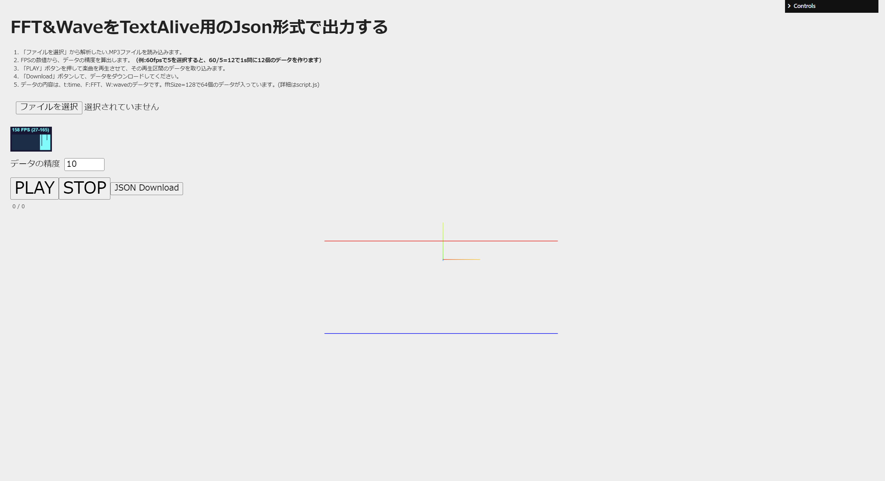

# FFT&WAVE Json_Download -TextAlive-



MP3のAudioデータのFFT&WaveデータをTextAlive_API用のJSON形式でダウンロードするサイトです。

This is a site to download FFT&Wave data of MP3 Audio data in JSON format for TextAlive_API.

## Demo

https://misora.main.jp/ea4azmyb/createjson/

## Getting Started
Download and install Node.js on your computer (https://nodejs.org/en/download/).

Then, open VSCODE, drag the project folder to it. Open VSCODE terminal and install dependencies (you need to do this only in the first time)
```
npm install
```

Run this command in your terminal to open a local server at localhost:8080
```
npm run dev
```

## Resource

Three.js